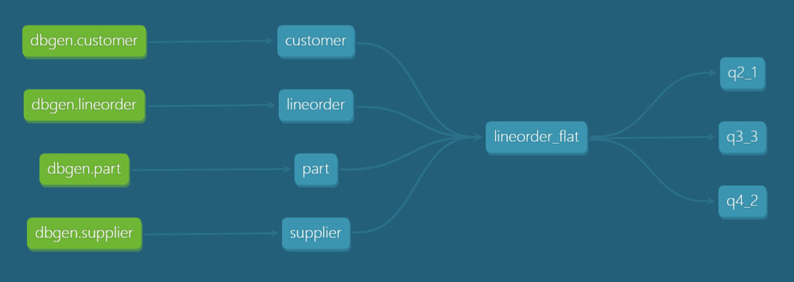

### Домашняя работа №2 по курсу OTUS Data Warehouse Analyst
Целью домашнего задания является развертывание кластера ClickHouse в Яндекс.Облаке, 
создание учебного проекта dbt для загрузки данных из S3 и построения витрин.
Описание задания: https://gist.github.com/kzzzr/8d50126079df1a8e5646342f6247df22

### Создание кластера
Осуществляется скриптом `tools/create_clickhouse_cluster.sh`, либо при помощи Terraform:
```
cd tools/yandex-cloud-terraform
terraform init
terraform apply
```

### Модель данных


### Имеющиеся проблемы
На момент сентября 2021 года (актуальная версия dbt - 0.20.1) у dbt имеются проблемы с интеграцией ClickHouse:
- некорректно работают тесты
- не работает генерация моделей при помощи пакета codegen

Требуется заведение issue в соответствующих проектах. Workaround:
- Ошибка `0.0 is not of type 'boolean'` в тестах unique, not_null (https://github.com/dbt-labs/dbt/issues/3872):
  - закомментировать `TestResultData.validate(test_result_dct)` в `dbt/task/test.py:108`  
    (проверка на соответствие схеме, ClickHouse не поддерживает тип boolean)


- Ошибка ``DB::Exception: Column `C_MKTSEGMENT` is not under aggregate function and not in GROUP BY`` в тестах accepted_values:
  - заменить `group by 1` на `group by value_field` в `dbt/include/global_project/macros/schema_tests/accepted_values.sql:10`  
    (ClickHouse не умеет группировать по номеру поля)


- Ошибка `DB::Exception: Syntax error: failed at position 550 ('.') (line 15, col 14): .information_schema.tables` при выполнении макроса generate_source: 
  - добавить в `dbt_modules/dbt_utils/macros/sql/get_tables_by_pattern_sql.sql`:
    ```
    
    
            select
                database as "table_schema",
                name as "table_name",
                'table' as "table_type"
            from system.tables
            where database ilike '{{ schema_pattern }}'
            and name ilike '{{ table_pattern }}'
            and name not ilike '{{ exclude }}'
    
    
    ```

- Ошибка `Encountered an error while running operation: Runtime Error
  Field "path" of type dbt.contracts.relation.Path in dbt.adapters.clickhouse.relation.ClickhouseRelation has invalid value {'database': Undefined, 'schema': 'dbt', 'identifier': 'customer'}` при выполнении макроса generate_source:
  - запускать как `dbt run-operation generate_source --args "{database_name: dbt, schema_name: dbt, generate_columns: True}"`


- Тест `dbt_utils.at_least_one` работает некорректно: при отсутствии записей результат - PASS  
  Из-за бага в ClickHouse (https://github.com/ClickHouse/ClickHouse/issues/28880) оператор `having count(column) = 0` возвращает пустое множество, а не строку с нулем.
  - добавить в `dbt_modules/dbt_utils/macros/schema_tests/at_least_one.sql`:
    ```
    

    select cnt
    from (
        select count(*) as cnt
        from {{ model }}
        limit 1
    )
    where cnt = 0

    
    ```
  
- Тесты relationships не обнаруживают некорректные внешние ключи
  - Задать настройку ClickHouse join_use_nulls = 1
